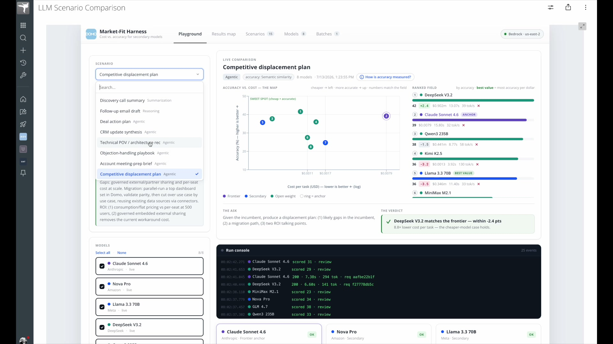
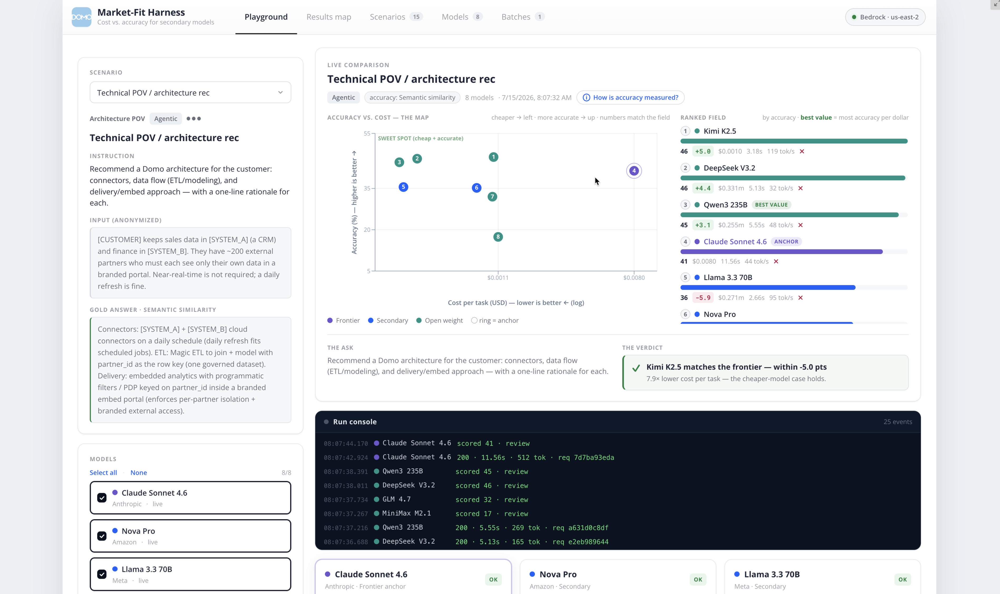
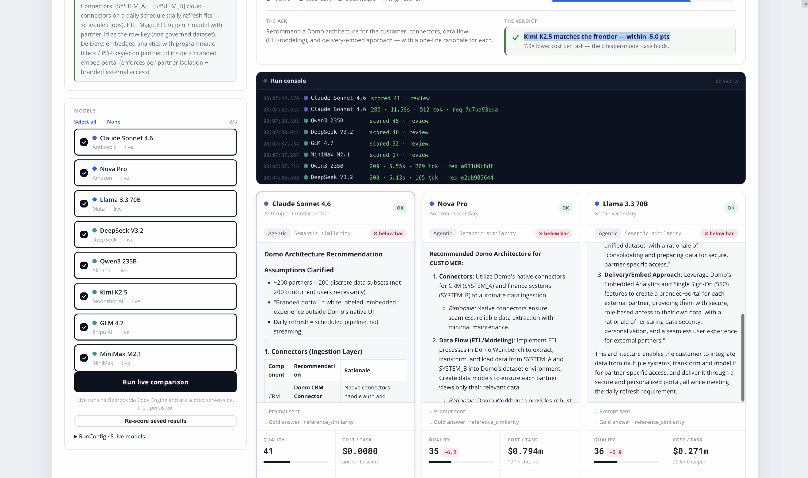
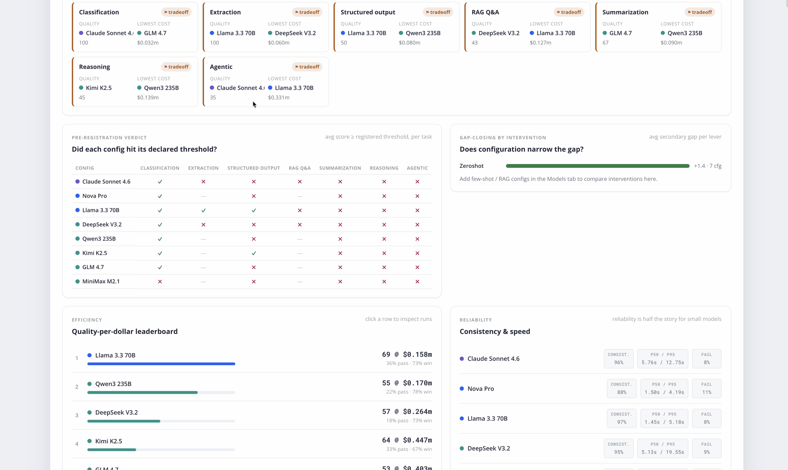
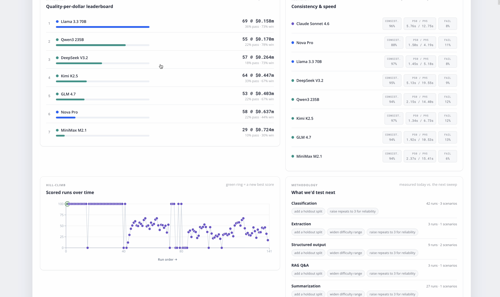
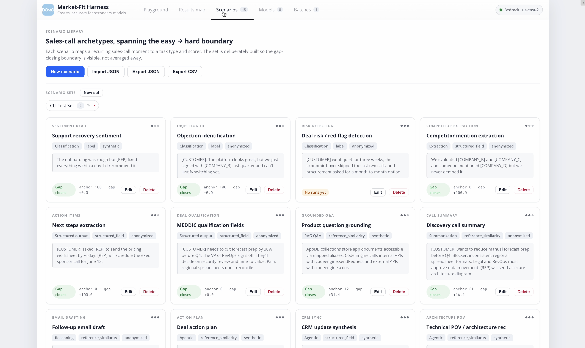
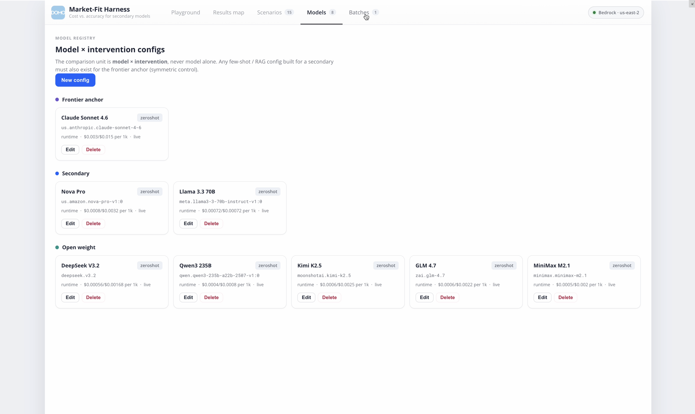
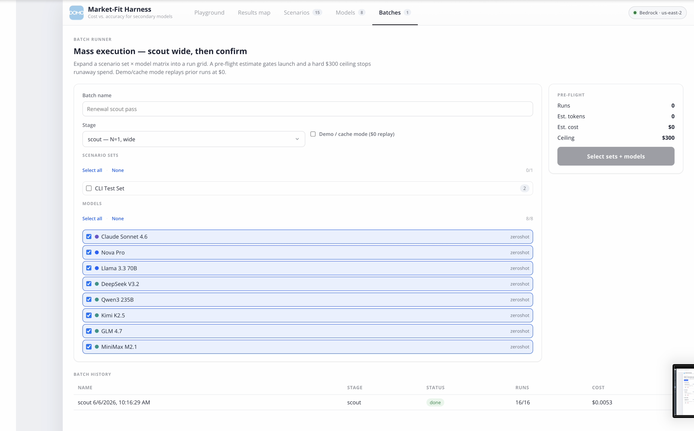

# LLM Market-Fit Investigation Harness

> **Cost-vs-accuracy evidence for the "cheaper model" thesis.** A Domo-hosted harness that runs real customer tasks against a frontier anchor and a fleet of secondary/open-weight models on Amazon Bedrock, then maps where the cheaper model closes the gap — and where it breaks down. The output is not a winner. It is a **map, segmented by task type.**


---

## Table of Contents

1. [What Problem Does This Solve?](#what-problem-does-this-solve)
2. [Demo](#demo)
3. [Architecture](#architecture)
4. [Model Lineup](#model-lineup)
5. [The App — Five Views](#the-app--five-views)
   - [Playground](#playground)
   - [Results Map](#results-map)
   - [Scenarios](#scenarios)
   - [Models](#models)
   - [Batches](#batches)
6. [Methodology — Why the Results Are Defensible](#methodology--why-the-results-are-defensible)
7. [Data Model](#data-model)
8. [Cost Controls](#cost-controls)
9. [Security & Data Handling](#security--data-handling)
10. [Development & Deployment](#development--deployment)
11. [Project Structure](#project-structure)
12. [Roadmap](#roadmap)
13. [License](#license)

---

## What Problem Does This Solve?

The forecast that "cost pressure will push demand toward cheaper models" is only credible if you can show *where* a properly-configured secondary model actually reaches frontier-comparable accuracy on real work — and, just as important, where it does not. Blended benchmark numbers hide that boundary by averaging it away.

This harness is a **market-investigation tool**, not a one-off benchmark. It exists to answer one question with defensible evidence:

> For which kinds of real Domo-customer tasks does a properly-configured *secondary* (open-source / cheaper) model close the accuracy gap with a *frontier* model enough that the cost savings justify it — and where does that case break down?

It tests two hypotheses:

| Hypothesis | Statement | How this tool relates |
|---|---|---|
|  | Cost pressure pushes demand toward secondary models. | Produces the *input* to that judgment, not the judgment itself. |
|  | With proper context + post-training, a secondary model reaches frontier-comparable accuracy on a given task. | Tested **directly**, task type by task type. |

Scenarios come from anonymized sales-call transcripts, deliberately chosen to span the easy-gap-closes end (extraction, classification) through the gap-persists end (multi-step reasoning, nuanced drafting), so the boundary shows up in the results instead of being averaged out.

---

## Demo

A 28-second walkthrough of the live Playground: pick a scenario, run the full model lineup against it, and read the cost-vs-accuracy map, the ranked field, and the verdict banner.

<p align="center">
  <a href="docs/media/llm-scenarios-screen.mp4">
    
  </a>
</p>

<p align="center">
  <video src="https://github.com/cassidythilton/model-scenario-planner/raw/main/docs/media/llm-scenarios-screen.mp4" poster="docs/media/demo-poster.jpg" controls muted width="900"></video>
</p>

> If the player does not load inline, [watch the demo directly](docs/media/llm-scenarios-screen.mp4).

---

## Architecture

A **three-layer system**. The browser never touches AWS credentials; every model call is brokered server-side.

```
┌───────────────────────────────────────────────────────────────────────────┐
│                    EXPERIENCE LAYER (React custom app)                      │
│                                                                             │
│   Playground  │  Results Map  │  Scenarios  │  Models  │  Batches           │
│   UI + orchestration only · no AWS credentials client-side · Recharts       │
└───────────────────────────────────────┬─────────────────────────────────────┘
                                         │  domo.post(...)
                                         ▼
┌───────────────────────────────────────────────────────────────────────────┐
│                   BROKER LAYER (Domo Code Engine · JS)                       │
│                                                                             │
│   runScenario  ── one scenario × model-config → Bedrock, normalized result  │
│   scoreRun     ── grades output vs. curated gold answer                      │
│   Holds the Bedrock API key (Bearer) · injected at deploy, never in git      │
│                                                                             │
│   ┌── runtime  (Converse) ──────► Claude · Nova · Llama                       │
│   └── mantle   (chat-completions) ► DeepSeek · Qwen · Kimi · GLM · MiniMax    │
└───────────────────────────────────────┬─────────────────────────────────────┘
                                         │  HTTPS · us-east-2
                                         ▼
┌───────────────────────────────────────────────────────────────────────────┐
│                          Amazon Bedrock (us-east-2)                          │
└───────────────────────────────────────────────────────────────────────────┘

        ▲ read/write
        │
┌───────┴───────────────────────────────────────────────────────────────────┐
│                     PERSISTENCE LAYER (Domo AppDB)                           │
│   scenarios · model_configs · runs · evals · batches · scenario_sets         │
│   (namespaced llmharness_*)                                                  │
└───────────────────────────────────────────────────────────────────────────┘
```

| Layer | Technology | Core principle |
|---|---|---|
|  | React 18 · TypeScript · Vite · Recharts | UI and orchestration only. No AWS credentials in the browser. Reporting is in-app (no Domo Cards). Built as an IIFE bundle so it runs reliably inside Domo's custom-app iframe. |
|  | Domo Code Engine (JavaScript) | One normalized contract; an adapter routes each model to the right Bedrock path. The Bedrock API key lives only in the function source, injected at deploy time. |
|  | Bedrock Converse + chat-completions | A frontier anchor plus seven secondary/open-weight models behind a single interface. |
|  | Domo AppDB | Six collections hold all app state. Runs and evals are persisted for reproducibility. |

---

## Model Lineup

The comparison unit is always **model × intervention**, never model alone. One normalized Code Engine contract routes each model through the right Bedrock path, so adding a model is a config change, not a code change.

| Model | Role | Bedrock path |
|---|---|---|
|  | Frontier anchor | `runtime` (Converse) |
|  | Secondary | `runtime` |
|  | Secondary | `runtime` |
|  | Open weight | `mantle` (chat-completions) |
|  | Open weight | `mantle` |
|  | Open weight | `mantle` |
|  | Open weight | `mantle` |
|  | Open weight | `mantle` |

> Model IDs and per-token prices change frequently. Pull both from the live Bedrock console when populating the registry rather than hardcoding.

---

## The App — Five Views

###  Playground

Pick a scenario (or a freeform prompt), select any subset of the model lineup, and run a live comparison. The **accuracy-vs-cost map** plots every model (cheaper → left, more accurate → up), the **ranked field** orders them by accuracy with per-dollar "best value" callouts, and a **verdict banner** states plainly whether the cheaper-model case holds for this task. A live **run console** streams each call and score as it lands.

<p align="center">
  
</p>

Below the map, every model's full output renders **side-by-side** with its quality score, cost per task, latency, tokens, and the exact prompt sent — so a claim like "10.1× cheaper at −6.2 points" is always traceable back to the raw generation.

<p align="center">
  
</p>

###  Results Map

The analysis surface. It never reports a single blended accuracy number — everything is segmented by task type.

| Panel | What it answers |
|---|---|
|  | For each task type, which config wins on quality and which on lowest cost. |
|  | Did each config hit its *declared* threshold, per task type? Pass / fail grid. |
|  | Does configuration (few-shot / RAG) narrow the secondary-vs-frontier gap? |

<p align="center">
  
</p>

Reliability is treated as first-class, because run-to-run variance is half the story for smaller models: a **quality-per-dollar leaderboard**, a **consistency & speed** table (consistency %, p50/p95 latency, failure rate), a **hill-climb** of scored runs over time, and a **"what we'd test next"** panel that proposes the next sweep per task type.

<p align="center">
  
</p>

###  Scenarios

The scenario library — the source of realism. Each card maps a recurring sales-call moment (sentiment read, objection ID, risk detection, competitor extraction, action items, MEDDIC qualification, grounded Q&A, call summary, email draft, agentic planning) to a **task type** and a **scorer**, with an anonymized input and a curated gold answer. Author, tag, import (JSON), and export (JSON / CSV); group scenarios into reusable **Scenario Sets**.

<p align="center">
  
</p>

###  Models

The model × intervention registry, grouped by role (frontier anchor / secondary / open weight). Each config carries its resolved Bedrock model ID, path, intervention level, and per-1k pricing. The **symmetric-control rule** is enforced here: any few-shot / RAG config built for a secondary model must also exist, unchanged, for the frontier anchor — the UI makes the rigged comparison hard to do by accident.

<p align="center">
  
</p>

###  Batches

Mass execution. Expand a Scenario Set × model matrix into a full run grid, get a **pre-flight cost estimate** that gates launch, and run in two stages — a cheap wide **scout** (N=1) to eliminate dominated configs, then a deeper **confirm** (N=3) for the survivors. A hard **$300 ceiling** stops runaway spend, a **demo / cache mode** replays prior runs at $0, and batch history tracks status, run counts, and actual cost.

<p align="center">
  
</p>

---

## Methodology — Why the Results Are Defensible

| # | Guardrail | What it prevents |
|---|---|---|
| 1 |  Configured-vs-configured only | Never comparing a tuned secondary against a vanilla frontier. |
| 2 |  Fix the "match" threshold + config budget *before* running | Endlessly re-tuning a losing model until it "wins." |
| 3 |  Never a single blended number | Averaging away the boundary the study exists to find. |
| 4 |  Default N=3 at non-zero temperature | Treating a lucky single run as reliability. |
| 5 |  Tune and validate on different items | Validating tuning on the items it was tuned on. |
| 6 |  Representative tasks over public benchmarks | Benchmark contamination and irrelevance. |

---

## Data Model

Six AppDB collections, namespaced with the `llmharness_` prefix. Full field-level schema in [`appdb/collections.md`](./appdb/collections.md).

| Collection | Holds |
|---|---|
| `llmharness_scenarios` | The unit of work — a task with a curated gold answer. |
| `llmharness_model_configs` | One row per model × intervention combination. |
| `llmharness_runs` | One model execution (supports N repeats), with the full resolved prompt for reproducibility. |
| `llmharness_evals` | Score(s) for a run, with `scorer_version` for traceability. |
| `llmharness_batches` | A mass run; carries the pre-registration record and progress for resumability. |
| `llmharness_scenario_sets` | Named, reusable collections of scenarios. |

Scoring dispatches on `scorer_type`: `exact` (normalized string equality), `structured_field` (per-field precision/recall/F1 vs. gold JSON), `label` (label match), and `reference_similarity` (embedding cosine vs. gold; below-threshold results are flagged `needs_human_review`).

---

## Cost Controls

-  enforced server-side; estimated active spend ~$100–180/mo.
- **Staged execution** — a cheap wide *scout* pass eliminates dominated configs before the deeper *confirm* pass spends real budget.
- **Pre-flight estimate** on every batch (runs × est. tokens × per-model price), with explicit confirmation to launch.
- **Dry-run mode** validates the run grid and cost estimate without invoking any model.
- **Prompt caching** on Claude/Nova for shared context; sane per-task `max_tokens`.

---

## Security & Data Handling

-  The Bedrock API key lives only in the Code Engine function source, injected at deploy from a gitignored `key` file — never in the browser, never in git.
-  Real transcripts are scrubbed with a stable token scheme (`[CUSTOMER]`, `[REP]`, `[COMPANY_A]`, …) *before* anything enters AppDB. Only the anonymized excerpt is stored or sent; the raw transcript never lands in the harness.
- No customer financial or identity data is ever entered into scenarios.
- `.gitignore` excludes all credential material (`key`, `*api-key*.csv`, `payload.json`, `*credentials*`, `.env*`). This repository has been scanned to confirm no secrets are committed.

---

## Development & Deployment

**Prerequisites:** Node 18+, a Domo instance with Code Engine and custom-app publishing, and Bedrock access in `us-east-2`.

```bash
# Frontend
cd app
npm install
npm run dev          # local dev against demo bootstrap data
npm run build        # IIFE bundle + manifest → app/dist (publish this to Domo)
```

**Backend (Code Engine).** Each function ships an `index.js` with a `__BEDROCK_API_KEY__` placeholder and a `build-payload.mjs` that injects the key at deploy time from a gitignored root `key` file. See [`codeengine/bedrock-broker/README.md`](./codeengine/bedrock-broker/README.md) for the full contract, input types, and smoke-test runbook. After deploy, wire the `packageId` and `version` into [`app/manifest.json`](./app/manifest.json).

---

## Project Structure

```
.
├── app/                          React + Vite + TS custom app (frontend)
│   ├── src/
│   │   ├── components/           Playground, ResultsMap, ScenarioLibrary, ModelRegistry, BatchRunner, …
│   │   ├── lib/                  bootstrap, domo/appdb wiring, scoring, metrics, batch orchestration
│   │   ├── data/                 seed scenarios + registry
│   │   ├── types/                harness domain types
│   │   └── App.tsx               five-view shell
│   └── manifest.json             Domo app id + collection/package mappings
├── codeengine/
│   ├── bedrock-broker/           runScenario — brokers all Bedrock traffic + contract
│   └── scorer/                   scoreRun — gold-answer scoring
├── appdb/
│   └── collections.md            AppDB collection schema definitions
├── docs/
│   ├── decisions-log.md          running decision record + open items
│   ├── shaping/                  Shape Up-style pitches and spikes
│   └── media/                    demo video + screenshots
├── llm-harness-scope-v0.1.md     scope & requirements
└── llm-harness-build-plan-v0.1.md build plan & technical spec
```

See [`llm-harness-scope-v0.1.md`](./llm-harness-scope-v0.1.md), [`llm-harness-build-plan-v0.1.md`](./llm-harness-build-plan-v0.1.md), and [`docs/decisions-log.md`](./docs/decisions-log.md) for full scope, spec, and the running decision record.

---

## Roadmap

| Phase | State | Scope |
|---|---|---|
|  | Done | Code Engine + adapter, AppDB collections, one-scenario smoke test. |
|  | Current | Full 8-model registry, scenario authoring + anonymization, zero-shot / few-shot / RAG, eval engine, manual + batch modes, React reporting. |
|  | Planned | Fine-tuning arms (Bedrock SFT; RFT on Nova as a near-direct H2 test), real RAG via Bedrock Knowledge Bases, human-eval review queue, multi-user sharing, scheduled drift re-runs. |

---

## License

Internal Domo SE tooling. Not currently licensed for redistribution.
