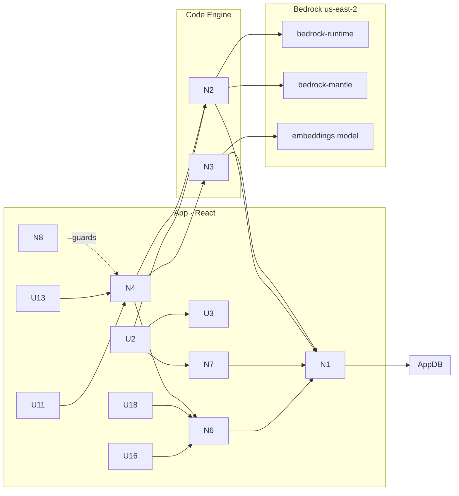

# LLM Market-Fit Harness — Slices (Shape B build plan)

Implementation plan for **Shape B** (see [`shaping.md`](./shaping.md) for R, the shape parts B1–B10, and the locked study parameters). This doc is ground truth for **slice definitions, per-slice affordances, and wiring**. Each slice ends in **demo-able UI**.

**Ground rules carried in from shaping:**
- One frontier anchor (Claude Sonnet 4.6) + 2 secondary (Nova, Llama) + 5 open-weight (DeepSeek V3.2, Qwen3, Kimi K2.5, GLM 4.7, MiniMax M2.1) = **8 models**.
- One OpenAI Chat-Completions schema + one SigV4 signer; `endpoint` = runtime|mantle per registry entry (S1).
- $300/mo hard cost ceiling; staged scout→confirm; dry-run + pre-flight estimate (O5).
- Anonymization = S2-B vetted manual first pass; **no raw-transcript field exists** on the Scenario record (O6/S2).

---

## Places (where work lands)

| Place | What lives here |
|---|---|
| **App** | React custom app (`app/`) — UI + orchestration. No AWS creds. |
| **CE** | Code Engine functions (`codeengine/`) — `runScenario` (adapter), `scoreRun` (eval). Hold AWS creds via mapped Domo Account. |
| **DB** | AppDB collections (`appdb/`) — Scenario, ModelConfig, Run, Eval, Batch, ScenarioSet. |
| **BR** | Amazon Bedrock — `bedrock-runtime` + `bedrock-mantle` (us-east-2). |

---

## Breadboard (Shape B)

### UI Affordances (Place: App)

| ID | Affordance | Wires Out |
|---|---|---|
| U1 | App shell + nav (Playground · Library · Batches · Analytics · Registry) | — |
| U2 | **Playground**: scenario picker / freeform prompt, 2–4 config multi-select, Run button | → N2 (runScenario), N3 (scoreRun), N1 (persist) |
| U3 | **RunConfig preview** (hashable JSON shown before run) | → N7 (hash) |
| U4 | **Result cards** side-by-side (output, score+breakdown, cost, latency, tokens, request id) | → reads N1 |
| U5 | Verdict banner (gap vs anchor) + "promote freeform → Scenario" | → N1 |
| U6 | **Scenario authoring form** (title, task_type, instruction, input_context, gold_answer, scorer_type, source, tags, split) | → N1 |
| U7 | Library list/cards + import/export (CSV/JSON) | → N1 |
| U8 | **ScenarioSet builder** | → N1 |
| U9 | **Model Registry admin** (add/edit ModelConfig incl. intervention_level, params, pricing, endpoint) | → N1 |
| U10 | Symmetric-control guard (an intervention added to a secondary must also exist for the anchor) | → N1, reads N6 |
| U11 | **Batch builder**: ScenarioSet × ModelConfig matrix, N-repeats, stage (scout/confirm) | → N4 |
| U12 | **Pre-registration form** (per-task threshold + config budget) | → N1 (Batch) |
| U13 | Pre-flight cost estimate + launch confirm (gated by $300 ceiling) | → N4 (dry-run), N8 |
| U14 | Batch progress / resume / pause view | → reads N4 |
| U15 | Demo/cache mode toggle | → N7 |
| U16 | **Analytics workspace**: Pareto per task_type, gap-by-intervention, reliability, pre-reg pass/fail, task-type leaderboards, Compare view | → reads N6 |
| U17 | **Run drill-down**: output-vs-gold diff + score breakdown | → reads N1 |
| U18 | **Showcase/story mode** + PDF/share memo export + "measured vs to-test" footer | → reads N6 |

### Non-UI Affordances

| ID | Affordance | Place | Wires Out |
|---|---|---|---|
| N1 | AppDB repositories (typed CRUD for all 6 entities; reconcile app types ↔ collection schema) | App↔DB | → DB |
| N2 | `runScenario` adapter — chat-completions over runtime/mantle, SigV4, fewshot/rag assembly, tokens/latency/cost, request id, dry-run, throttle | CE | → BR |
| N3 | `scoreRun` — dispatch on scorer_type: exact, structured_field (P/R/F1), label, reference_similarity (embeddings); `needs_human_review`; `scorer_version` | CE | → BR (embeddings) |
| N4 | **Batch orchestrator** — grid expansion, chunked async, resume, retry/backoff, stage scout→confirm | App | → N2, N3, N1, N8 |
| N5 | Symmetric-control + held-out-split rules | App | reads N1 |
| N6 | **Metrics aggregation** (extend `lib/metrics.ts`): per-cell aggregates, gap-to-frontier, quality/$, Pareto membership, variance, pass/fail vs threshold | App | reads N1 |
| N7 | **RunConfig hash + cache lookup** (demo-mode replay by `config_hash`) | App | → N1 |
| N8 | Cost guard — running total vs $300 ceiling, hard stop | App/CE | reads N1 |
| N9 | Registry seed (8 models) + scenario seed/migration from `demoHarness.ts` | App | → N1 |

### Wiring

---

## Slice overview

| Slice | Title | Shape parts | Demo-able exit |
|---|---|---|---|
| **V1** | Persisted, real-scored playground | B1, B2(S1), B4(core), B9, N9 | Live side-by-side run of Sonnet vs open-weight models on a saved scenario, with **real** scores + cost/latency, persisted across reload. |
| **V2** | Authoring, sets & registry | B3(synthetic/S2-B), B1(+), B2(registry admin), R1.2/R1.4 | Author a scenario from an anonymized excerpt, build a ScenarioSet, add a few-shot/RAG config in the registry (symmetric-guarded), run it in the playground. |
| **V3** | Batch engine + guardrails + cache | B5, B6, B10(cache), N8 | Launch a pre-registered scout batch over a set × matrix; pre-flight estimate gates it; watch it auto-score, persist, and stop at ceiling; demo-mode replays at $0. |
| **V4** | Analytics workspace | B7, N6(full) | After a batch, explore the map — Pareto per task type, gap-by-intervention, reliability, pre-reg pass/fail — and drill into a cell to see output-vs-gold. |
| **V5** | Showcase + full breadth | B8, B2(mantle confirm), B10(seed), Gong via S2-B | Guided story-mode walkthrough + exportable customer memo, exercising all 8 models and real anonymized Gong scenarios. |

> Slices are ordered so each builds on the last and is independently demo-able. V1 alone already replaces the demo shell with a real tool and serves as the early customer-demo surface (the C-sequencing goal).

---

## V1 — Persisted, real-scored playground

> 🟡 **Status: code-complete, build green; pending CE deploy + re-smoke.** Implemented: chat-completions broker, `scoreRun` eval fn, `runConfig` hash, type reconciliation, 8-model registry, AppDB repos + bootstrap, playground persistence + RunConfig preview. Remaining to demo live: create AppDB collections, deploy both CE packages (fill scorer `packageId`), change `bedrockAccount` input to Account type, re-smoke-test. See [`V1-plan.md`](./V1-plan.md).

**Goal:** Kill the synthetic data. A run is a real Bedrock call, scored by a real scorer, persisted to AppDB, reproducible from a hashable RunConfig.

| Affordances added | U1, U2, U3, U4, U5, N1, N2(rework), N3, N7, N9 |
|---|---|

**Parts/mechanisms:**
- **N9 + DB:** create the 6 AppDB collections; seed the 8-model registry (Sonnet 4.6 anchor via inference profile + Nova + Llama + DeepSeek/Qwen/Kimi/GLM/MiniMax with correct `endpoint`, ids, pricing); migrate the 9 demo scenarios into `llmharness_scenarios` as initial synthetic seed.
- **N1:** typed AppDB repositories; **reconcile app types with the collection schema** (add `endpoint`, `batch_id`, `split`, `source_ref`, `score_breakdown`, `scorer_version`; add `agentic` to `TaskType`).
- **N2 (rework broker):** switch `runScenario` from Converse to **OpenAI Chat-Completions**; sign per-entry host (`bedrock-runtime` / `bedrock-mantle`); parse `choices[0].message.content` + `usage.prompt_tokens/completion_tokens`; capture `x-amzn-requestid`. Keep dry-run + throttle handling.
- **N3 (scoreRun CE fn):** real scorers — `label` (normalized match), `structured_field` (JSON parse → field P/R/F1), `reference_similarity` (Bedrock embeddings cosine; below-threshold → `needs_human_review`), `exact`. Stamp `scorer_version`.
- **N7:** compute `config_hash` from RunConfig; show RunConfig preview (U3) before run.
- **U2/U4/U5:** playground runs selected configs, persists Run + Eval, renders side-by-side cards with real score breakdown, verdict vs anchor, promote-freeform.

**Exit criteria (demo):** pick a saved scenario, select Sonnet + DeepSeek + Qwen, run; see three real outputs with real scores, cost, latency, tokens, and request ids; reload the page and the runs are still there.

---

## V2 — Authoring, sets & registry

> 🟡 **Status: code-complete, build green.** Implemented: scenario authoring (create/edit/delete) with the S2-B anonymization notice + `split`/`source_ref`, JSON import + JSON/CSV export, ScenarioSet builder, a new **Models** tab (registry admin) with the symmetric-control guard (+ one-click "create matching anchor"), all persisted via AppDB repos with demo/local fallback. CSV import deferred. See [`V2-plan.md`](./V2-plan.md).

**Goal:** Make the library real and editable, including the intervention ladder and the anonymization discipline.

| Affordances added | U6, U7, U8, U9, U10, N1(+), N5 |
|---|---|

**Parts/mechanisms:**
- **U6/U7:** Scenario CRUD form + list, CSV/JSON import/export. **No raw-transcript field** — `input_context` accepts only already-anonymized text (S2-B); UI copy states the manual-redaction requirement and the `[CUSTOMER]/[REP]/[COMPANY_A]` token scheme. `source`/`source_ref`/`split` captured.
- **U8:** ScenarioSet builder (named, reusable).
- **U9 (registry admin):** add/edit ModelConfig including `intervention_level` (zeroshot/fewshot/rag), `params`, `fewshot_examples`, `context_strategy_ref`, pricing, `endpoint`. This is where the **intervention ladder** (R1.2) becomes data.
- **U10/N5:** symmetric-control guard — adding a few-shot/RAG config for a secondary requires the same intervention exist for the anchor; held-out `split` honored by tuning flows.

**Exit criteria (demo):** author a new scenario from an anonymized excerpt, tag it, add it to a set; create a "DeepSeek — few-shot" config and watch the UI require a matching "Sonnet — few-shot"; run the new scenario+config in the playground.

---

## V3 — Batch engine + guardrails + cache

> 🟡 **Status: code-complete, build green.** Implemented: `Batch` type + repos/bootstrap, `lib/batch.ts` (grid expansion, dry-run cost estimate, chunked orchestrator with $300 ceiling + throttle backoff + cache/demo replay), shared `lib/scoring.ts`, and a **Batches** tab (builder, scenario-set × model matrix, scout/confirm staging, pre-registered thresholds, pre-flight gate, live progress/pause, batch history). Auto scout→confirm promotion deferred. See [`V3-plan.md`](./V3-plan.md).

**Goal:** The "automate mass scenarios" core, done safely.

| Affordances added | U11, U12, U13, U14, U15, N4, N7(cache), N8, Batch entity |
|---|---|

**Parts/mechanisms:**
- **U11 + N4:** expand ScenarioSet × ModelConfig × N-repeats into a run grid; chunked async execution respecting per-model rate limits; **resume** from `progress`, retry + exponential backoff on `throttled`.
- **U12 + Batch:** pre-registration record (per-task threshold + config budget) stored on the Batch.
- **B6 staging:** `stage = scout` (N=1, wide) → eliminate dominated cells → `stage = confirm` (N=3) on survivors.
- **U13 + N8:** pre-flight `dry_run` across the grid → `cost_estimate`; launch gated by explicit confirm; **$300 `cost_ceiling` hard stop** as `cost_actual` accrues.
- **N7 cache (B10):** demo/cache mode replays runs by `config_hash` for $0 deterministic demos.

**Exit criteria (demo):** build a scout batch, see the pre-flight estimate, confirm, watch progress auto-score + persist; toggle demo mode and re-run instantly at $0; confirm the ceiling blocks an over-budget launch.

---

## V4 — Analytics workspace

> 🟡 **Status: code-complete, build green, published.** Implemented: interactive **Recharts Pareto scatter** (per-task filter, click-to-drill), **pre-registration pass/fail matrix** (config × task vs threshold), **gap-closing-by-intervention** panel, **run drill-down modal** (output vs gold + score breakdown), plus the retained heroes / gap-by-task / quality-per-dollar leaderboard / reliability / recent-runs. `gapByIntervention` added to `lib/metrics.ts`. See [`V4-plan.md`](./V4-plan.md). (Bundle grew ~390KB from Recharts — acceptable for an internal tool; code-split later if needed.)

**Goal:** Turn persisted runs into the defensible map.

| Affordances added | U16, U17, N6(full) |
|---|---|

**Parts/mechanisms:**
- **N6:** extend `lib/metrics.ts` — per (model × intervention × task_type) aggregates; gap-to-frontier (abs + rel); quality-per-dollar; Pareto-frontier membership; variance/consistency; format-valid + failure-severity; pass/fail vs pre-registered threshold; gap-closing-by-intervention; break-even volume.
- **U16 (Recharts):** Pareto frontier per task_type, gap-by-intervention (secondary vs frontier), reliability view, pre-reg pass/fail, task-type leaderboards, cross-task **Compare** view (small multiples).
- **U17:** cell → run drill-down with output-vs-gold diff + score breakdown.

**Exit criteria (demo):** open Analytics after a batch; read the cost-vs-accuracy Pareto per task type; see where the cheap-model thesis holds vs breaks; drill into a losing cell to read the actual model output against gold.

---

## V5 — Showcase + full breadth

**Goal:** Make it presentation-grade and exercise the full study.

| Affordances added | U18, B2(mantle confirm), B10(seed), Gong scenarios |
|---|---|

**Parts/mechanisms:**
- **U18:** guided story-mode wrapping the analytics ("the map"); PDF/share **memo export**; "what we measured vs what we'd test next" footer (borrowed from the reference app).
- **B2 mantle confirm:** verify any models that prefer the `bedrock-mantle` host run cleanly end-to-end across all 8.
- **B10 seed:** cached-run seed script for reliable $0 demos.
- **Gong (S2-B):** populate the library with the first batch of manually-anonymized real scenarios.

**Exit criteria (demo):** run a guided narrative walkthrough end-to-end on real anonymized Gong scenarios across all 8 models, and export a customer-ready memo.

---

## Consistency notes (multi-level)

- This doc's slices reference shape parts **B1–B10** in `shaping.md`. If a slice reveals a new mechanism or re-scopes a part, update `shaping.md` (parts table) **and** this doc together.
- AppDB schema (`appdb/collections.md`) is the field-level ground truth; the app types in `app/src/types/harness.ts` must be reconciled to it in **V1/N1** (current drift: missing `agentic`, `endpoint`, `batch_id`, `split`, `source_ref`, `score_breakdown`, `scorer_version`).
- Per-slice implementation detail (function signatures, component trees) belongs in individual `V1-plan.md`, `V2-plan.md`, … created when each slice starts.

## Deferred to Phase 2 (not sliced here)

Fine-tuning arms (SFT/RFT), real RAG via Bedrock Knowledge Bases, automated anonymization (S2-A), human-review queue UI, multi-user/roles, scheduled drift re-runs.
